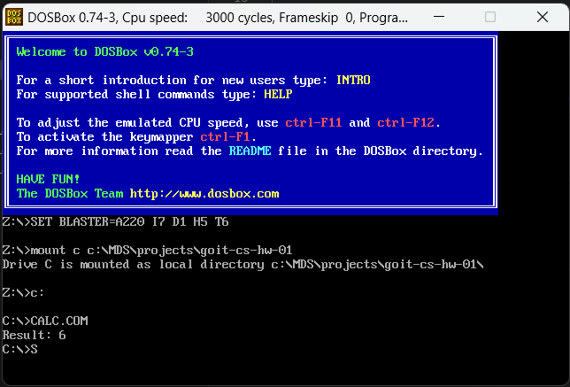

# GoITNeo CS HW-01

## Task1

Develop a program in assembly language that calculates the arithmetic expression `b - c + a`.

Use the example program for calculating `a + b - c` provided in the lecture notes (link to the repository folder), but with the necessary modifications to solve this task.

### Step-by-step instructions

* Study the code of the program that calculates `a + b - c` as presented in the lecture notes.
* Modify the program to perform the calculation according to the formula `b - c + a`.
* After making changes to the code, compile and run the program to verify that it correctly computes the expression `b - c + a`.
* Your program should display the calculation result on the screen.
* After running the program in DOSBox, take a screenshot of the DOSBox window displaying the result of executing your program.

### Solution

The program is in the `calc.asm` file.

Compiled program is in the `calc.com` file.

Result of executing the program is displayed on the screen.

## Task2
You have a simple interpreter written in assembly language with support for arithmetic expressions, including addition and subtraction (link to the repository folder), but without support for multiplication, division or parentheses, as described in the lecture notes (link to the repository folder).

Your task is to extend this interpreter to support these additional operations.

### Step-by-step instructions

1. Modify the lexer `Lexer`
Add new token types for multiplication `MUL`, division `DIV` and parentheses, which open `LPAREN` and close `RPAREN` part of an arithmetic expression.
Modify method `get_next_token` of the class `Lexer` so that it recognizes these new symbols.

2. Modify the parser Parser
Add method `factor` for handling numbers and expressions in parentheses.
Modify method `term`, so that it includes handling of multiplication and division.
Make appropriate changes in method `expr` to support new hierarchy of operations.

3. Update the Interpreter
Add method `visit_BinOp` to the class `Interpreter` so that it can handle multiplication and division.

4. Testing
Verify that the interpreter works correctly on different arithmetic expressions, including expressions with parentheses, for example `(2 + 3) * 4` should give result `20`.

### Solution
